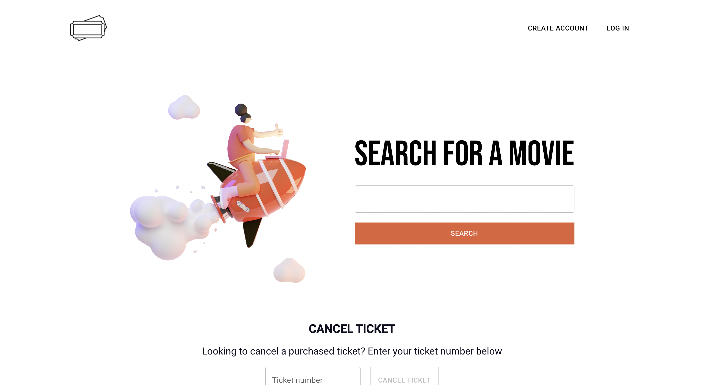
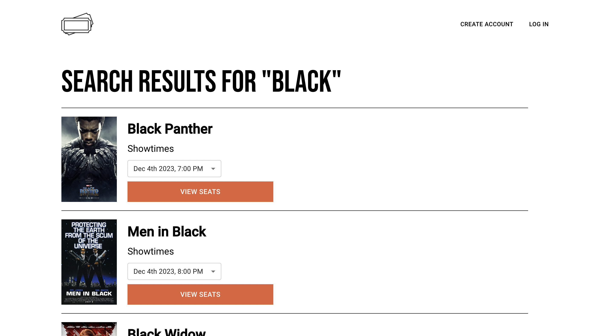
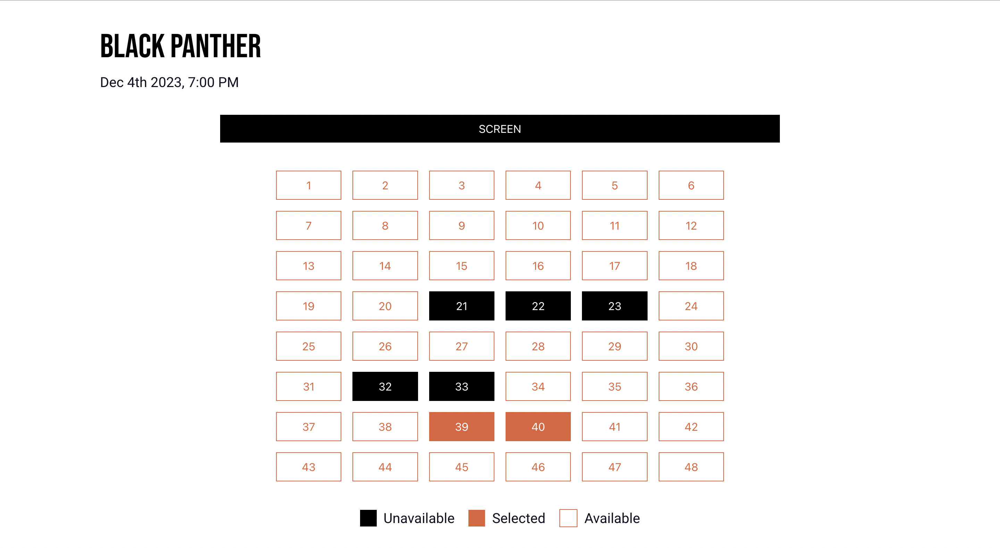
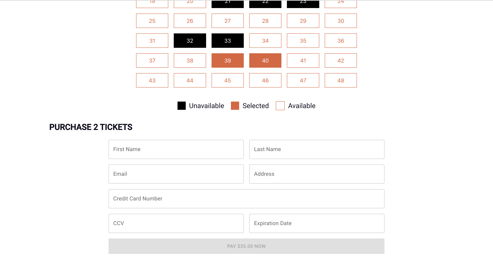
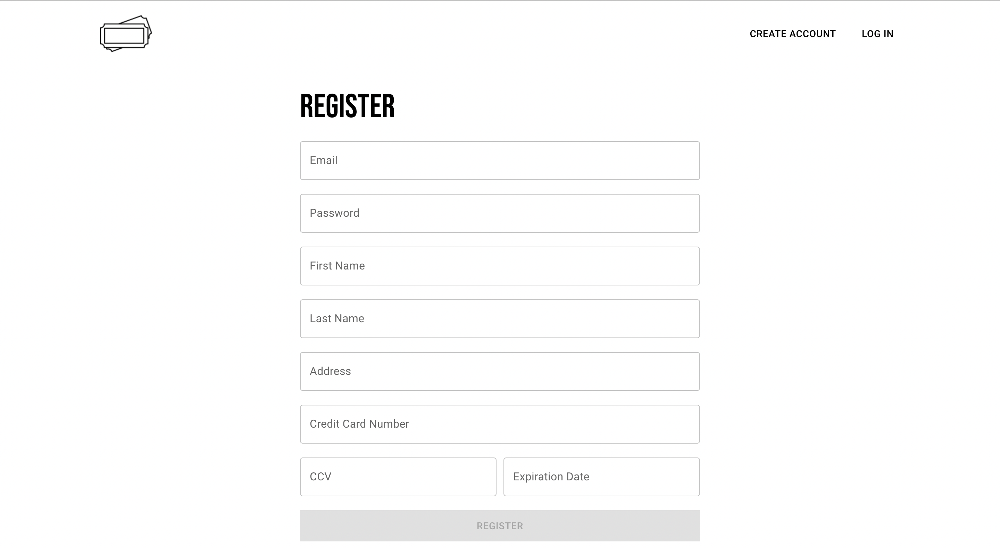
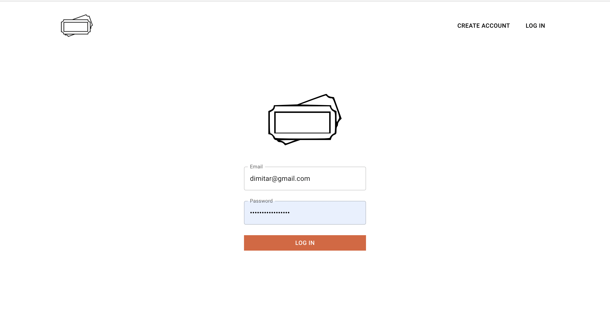

# Movie Ticket App

## Built with:
<div>


</div>

## Getting Started
### <ins>Frontend</ins>
Change into frontend directory: ```cd frontend```   
 
Install dependencies: ```yarn install```   

Start frontend: ```yarn start```   

### <ins>Backend</ins>
1. Download docker: https://www.docker.com/products/docker-desktop/
2. Open a terminal
3. Run the following:   
   1. ```docker run --name postgres-spring -e POSTGRES_PASSWORD=admin -d -p 5432:5432 postgres:alpine```
   2. ```docker ps```
   3. ```docker exec -it <container-id from the docker ps command> bin/bash```
   4. ```psql -U postgres```
   5. ```CREATE DATABASE springdb;```
   6. ```\c springdb```
4. Database is now fully setup
5. Change into backend directory: ```cd backend```
6. Run the following:
   1. ```brew install maven```
   2. ```mvn spring-boot:run```
7. Server should now be started on localhost:8080

## Screenshots
<center>Home Page</center>



<center>Movies Page</center>



<center>Seat Selection</center>



<center>Guest Checkout</center>



<center>Registration</center>



<center>Log In</center>

